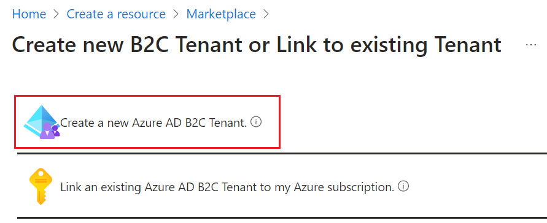
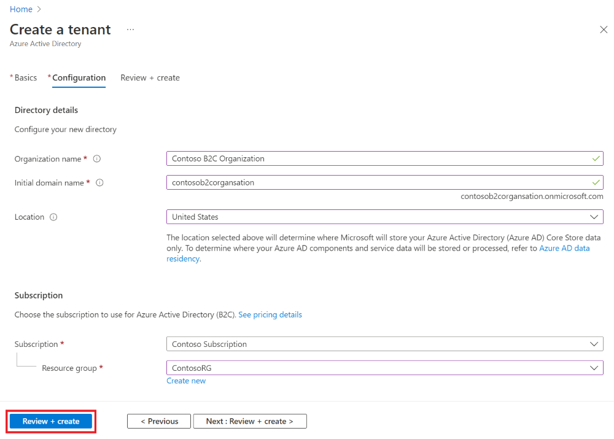

# Azure B2C Set Up
Follow these directions for creating the Azure B2C.

### Register Azure B2C Tenant

### Create an App Registration in the Azure B2C Tenant
Use the powershell scripts to create the registrations and identities.
1. Run the Installs.ps1
2. Run the Set Up Secrets.ps1
3. Run the B2C App Registration.ps1
